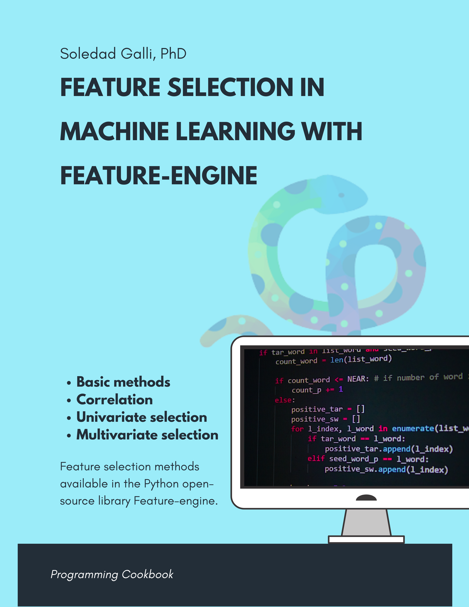



## Feature Selection with Feature-engine Book - Code Repository

Published August, 2022

## Links

- [Book](https://leanpub.com/feature-selection-machine-learning-feature-engine)

## Table of Contents

1. **Basic Selection Methods**
	1. Removing Constant Features
	2. Removing Quasi-Constant Features
	3. Removing Duplicated Features

2. **Correlation Feature Selection**
	1. Removing Correlated Features 
	2. Smart Correlation

3. **Univariate Methods**
	1. Single feature classifier
	2. Target mean encoding

4. **Other Feature Selection Methods**
	1. Feature Shuffling
	2. Recursive Feature Elimination
	3. Recursive Feature Addition
